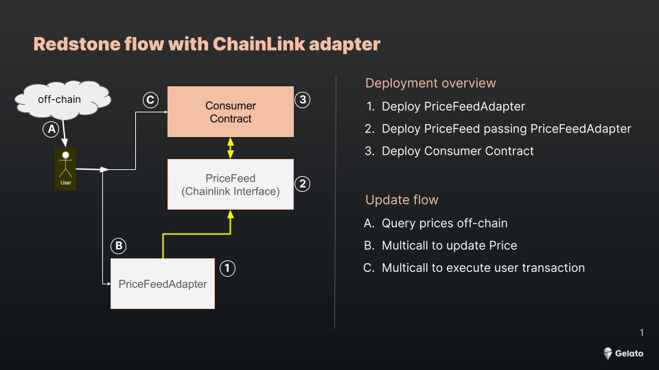

# RedStone with Chainlink adapter deployments on Gelato Raas 

This repo showcases how to deploy the RedStone Price Feed Adapters and Price Feeds in order to be compatble to the Chainlink Adapter Interface 


Deployment flow:




Current deployed PriceFeeds can be found [here](./docs/deployments.md)


## How to deploy a Redstone Price Feed adapter

1) Clone this repo

```shell
git clone
```

2) Install the npm modules

```shell
yarn install
```

3) Update the default network in `hardhat.config.ts` choosing the Gelato Rollup [here](./hardhat.config.ts#L34)


4) Copy the `.env.example` into a `.env` file and add the deployment Private Key. Update the `redstoneDeployer` deployer address [here](./hardhat.config.ts#L43)


5) Copy the Mock contracts [here](./contracts/PriceFeeds/MOCK/) and replace MOCK for your price feed, e. g. (ETH. GBP or XAU).


6) Copy the deploy [script](./deploy/MOCK.deploy.ts) and replace MOCK woth your price feed and run:

```shell
yarn deploy --network YOUR_ROLLUP --tags YOUR_PRICE_ID
```

7) Copy the [test file](./test/priceFeeds/Mock.ts) replace MOCK woth your price feed and run:
```shell
yarn test:file YOUR_PRICE_ID
```